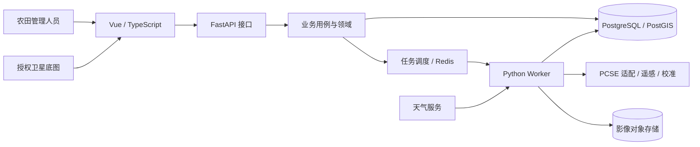

# 产品与实现架构

逻辑架构为模块化后端 + 独立算法包 + Vue Web 客户端。早期不拆大量微服务；未来重计算在独立 worker 进程运行。

上图是目标结构。当前 M1 已覆盖 Vue 农田页面 → FastAPI → FarmService/领域规则 → SQLAlchemy → SQLite/PostgreSQL；Q、W、E、天气、地图与对象存储未实现。本地默认 SQLite，Redis 暂不接入。

实际数据流见 [M1 数据流图](modules/farm-management.md)。前端的三个表单与状态集中于 features/farm，后端业务对象集中于 domain/farm；HTTP、用例、规则和 SQL 分层。

业务主数据以 SQL 为权威来源；Redis 不承载唯一业务事实；大影像采用对象存储，SQL 保存路径、版本、校验和和来源。模拟输入快照、管理事件、原始预测、遥感观测与校准结果分别留存，历史不得被无记录覆盖。

重计算目标流程：API 校验并记录任务 → worker 取不可变快照 → 运行模型或影像流程 → 保存版本化结果 → 更新任务状态 → 前端查询。任务幂等、失败重试、租约恢复和权限需在业务实现阶段验证。

设计图来源：`docs/diagrams/` 的架构、上下文/一级/遥感数据流图、ER 图、任务序列图。详细方案源文件在 `docs/design-baseline/design.json`。

## 模块边界

- API 层负责请求响应、认证/权限入口与错误映射。
- application 层负责用例、快照、事务、幂等与任务提交。
- domain 层负责不依赖框架的农业业务规则。
- infrastructure 层实现存储、天气与消息适配。
- crop_engine 只接受算法数据契约；不直接读 UI、HTTP 请求或数据库。

M1 引入 SQLAlchemy、Alembic、Psycopg 和 Playwright，用于真实存储、迁移与跨层验收。农业、GIS 与队列依赖按模块需要引入。部署、资源容量和 SLA 以试点测量为准，不以功能测试推断。
