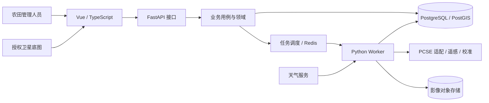

# 产品与实现架构

逻辑架构为模块化后端 + 独立算法包 + Vue Web 客户端。早期不拆大量微服务；未来重计算在独立 worker 进程运行。

上图是目标结构。当前 M1/M2 已覆盖 Vue 登录/农田/成员页面 → FastAPI 会话与权限入口 → FarmService、IdentityService/领域规则 → SQLAlchemy → SQLite/PostgreSQL；Q、W、E、天气、地图与对象存储未实现。本地默认 SQLite，Redis 暂不接入。

实际数据流见 [M1](modules/farm-management.md)与 [M2](modules/identity.md)。前端 farm、identity 各自集中组件与状态，后端对应领域与应用模块；共用分页/HTTP 不依赖业务模块。权限在 API 与限定组织的 SQL 查询边界强制检查。

M2 使用 SQL 会话与角色，不引入 JWT/Redis。密码经 Argon2id 哈希，随机会话 Cookie 的摘要存 SQL；CSRF 绑定会话，前端仅内存持有。业务和审计同事务，停用/改密码撤销会话。组织内共享地块，尚无逐成员地块权限。旧地块保留到明确初始化接收，不自动给首次登录者授权。依据见 [ADR 0003](adr/0003-identity.md)。

业务主数据以 SQL 为权威来源；Redis 不承载唯一业务事实；大影像采用对象存储，SQL 保存路径、版本、校验和和来源。模拟输入快照、管理事件、原始预测、遥感观测与校准结果分别留存，历史不得被无记录覆盖。

重计算目标流程：API 校验并记录任务 → worker 取不可变快照 → 运行模型或影像流程 → 保存版本化结果 → 更新任务状态 → 前端查询。任务幂等、失败重试、租约恢复和权限需在业务实现阶段验证。

设计图来源：`docs/diagrams/` 的架构、上下文/一级/遥感数据流图、ER 图、任务序列图。详细方案源文件在 `docs/design-baseline/design.json`。

## 模块边界

- API 层负责请求响应、认证/权限入口与错误映射。
- application 层负责用例、快照、事务、幂等与任务提交。
- domain 层负责不依赖框架的农业业务规则。
- infrastructure 层实现存储、天气与消息适配。
- crop_engine 只接受算法数据契约；不直接读 UI、HTTP 请求或数据库。

M1 引入 SQLAlchemy、Alembic、Psycopg 和 Playwright；M2 仅增加 argon2-cffi 密码依赖。农业、GIS 与队列依赖按需要引入。production 启动保护保留到 M7；部署、容量和 SLA 以试点测量为准，不以功能测试推断。
