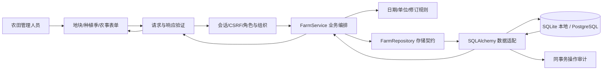

# M1 农田管理详细设计

状态：0.2.0 实现农田业务，0.3.0 接入 M2 组织授权与同事务审计。证据见 M1/M2 开发日志。需求关联：F02、F05、F12 的部分内容；地图圈地和生长模拟尚未实现。

## 用户链路

登记地块名称、手工面积与位置 → 建立水稻种植季，选择直播/移栽和开始日期 → 记录农事 → 查看保存结果与修订历史 → 结束种植季，开始下一季。

领域位于 `domain/farm`，应用服务位于 `application/farm_service.py`，HTTP 位于 `api/v1/farm.py`，SQL 细节位于 `infrastructure/database`。同一业务的地块、种植季与管理记录保持在一个模块内，不拆为独立服务。

## 已实现接口（与实际 OpenAPI 同步）

| 方法 | 路径 | 内容 |
|---|---|---|
| GET / POST | /api/v1/plots | 分页查询 / 登记地块 |
| GET | /api/v1/plots/{plot_id} | 地块详情 |
| GET / POST | /api/v1/seasons | 按地块分页查询 / 建立水稻种植季 |
| POST | /api/v1/seasons/{season_id}/close | 结束种植季 |
| GET / POST | /api/v1/management-events | 按种植季分页查询 / 登记农事 |
| POST | /api/v1/management-events/{event_id}/corrections | 新增修正版，保留原始记录 |

列表返回 items、total、limit、offset；农事列表默认只返回当前版本，include_history=true 返回修订历史。创建成功 201，正常查询/结束成功 200；不存在 404，业务日期/单位不合法 400，重复修正或冲突 409，请求结构不合法 422，存储不可用 503。

所有接口需登录 Cookie；写入还需 X-CSRF-Token 和管理员/农田管理角色。JSON 使用 Content-Type: application/json。查询在 SQL 限定当前组织，跨组织地块/种植季/农事 ID 返回 404；无会话 401，无权限/CSRF 错误 403。Plot 响应增加 organization_id，创建请求不能指定归属。详细角色与会话见 [M2](identity.md)。production 启动保护保留到 M7。

## 单位与规则

- 地块请求输入并保存原始 area_mu，响应派生 area_ha，1 公顷 = 15 亩。位置是 WGS84 经纬度点；面积是用户填报值，不是卫星或矢量量测结果。
- 一块地的种植季不得重叠；未结束季必须先结束才能建立下一季。日期边界含首尾，下一季开始日期必须晚于上一季结束日期。
- 农事不能早于种植季开始，已结束季的记录不能晚于结束日期。结束日期不能早于仍有效的农事记录。
- 灌溉量接受 mm 或 m3，体积按记录的地块面积换算为 mm；这里记录的是施用水量，不代表有效入渗或土壤水分。
- 施肥接受 kg/亩或 kg/公顷，保存标准 kg/ha，必须填写肥料名称。这是肥料产品质量，不是纯氮量，不能直接用作作物模型氮输入。
- 播种、移栽、巡田和收获不接受灌溉/肥料数量；备注与肥料名称分开。
- 每次修正指向当前版本，原因必填；一个版本只能被替代一次。不可重新修正已被替代的记录，也不覆盖原始内容。

## 数据一致性

本模块采用组织规则的逻辑外键：在同一事务中检查父对象，保留关系字段索引，不提供物理删除。PostgreSQL 对父对象加行锁，避免并发建立季节、关闭季节或修正农事的冲突；SQLite 作为本地开发存储，在写事务使用 BEGIN IMMEDIATE 串行处理写入。唯一修订指针与开放季唯一索引提供数据库约束。

数据表通过 Alembic 显式迁移建立。启动 API 不隐式建表。业务与审计在同一事务成功，审计失败时一起回滚。完整字段、约束与单位以 0001、0002 和 ORM 为实际版本，原方案数据字典仍为总体目标。
