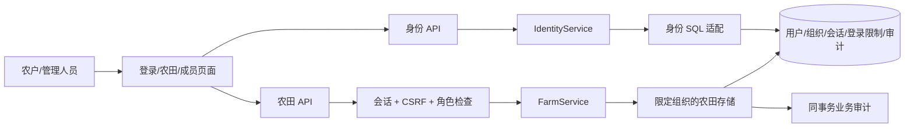

# M2 账户与地块授权

本模块在 0.3.0 实现登录、退出、改密码、成员管理、组织权限和操作审计。账号属于一个组织，组织内共享地块；管理员可建立、启用和停用成员。逐成员地块授权、公开注册、邮件和短信暂未实现。检查结果见 [开发日志](../dev-log/2026-10-08-identity.md)。

## 数据流

domain/identity 保持对象、角色与错误；application/identity_service 负责用例，存储和密码库分别通过接口调用；infrastructure 实现 SQL 和 Argon2id。农田存储在查询层限定组织，季节/农事通过父地块关联检查；跨组织 ID 返回 404。

## 角色

| 角色 | 农田读取 | 农田写入 | 成员/审计管理 |
|---|---|---|---|
| owner（管理员） | 本组织 | 本组织 | 本组织；不能停用管理员 |
| operator（农田管理） | 本组织 | 本组织 | 无 |
| viewer（只读） | 本组织 | 无 | 无 |

初始管理员由本机交互脚本建立，不提供匿名创建或默认密码。其他成员由管理员建立，可自行改密码；密码由管理员另行交付给成员。

## 接口设计

| 方法 | 路径 | 输入/结果与权限 |
|---|---|---|
| POST | /api/v1/auth/login | username/password → HttpOnly 会话 Cookie + 用户/组织/CSRF；匿名，检查 Origin |
| GET | /api/v1/auth/me | 当前用户、组织、CSRF；已登录 |
| POST | /api/v1/auth/logout | 撤销当前会话，清除 Cookie；已登录 + CSRF |
| POST | /api/v1/auth/password | current_password/new_password；修改后撤销全部会话；已登录 + CSRF |
| GET | /api/v1/organization | 当前组织；已登录 |
| GET/POST | /api/v1/users | 分页成员 / 建 operator 或 viewer，不能由客户端指定组织；管理员 |
| POST | /api/v1/users/{user_id}/active | is_active，停用同时撤销会话；管理员 |
| GET | /api/v1/audit-events | 分页审计，只有当前组织；管理员 |

业务 POST 使用 application/json、会话 Cookie 与 X-CSRF-Token。无会话或过期 401，角色/CSRF/Origin 不符 403，跨组织资源 404，重复用户名 409，登录限制 429，结构错误 422，存储错误 503。错误的当前密码为 400，保持有效会话。登录错误统一“账号或密码错误”；响应与日志不得包含密码、哈希或会话令牌，422 不返回原始输入。

## 安全与一致性

密码用 Argon2id，不可逆哈希；不自写密码算法。随机会话令牌仅 Cookie 携带，SQL 保存 SHA-256 摘要；固定 8 小时有效期，可撤销。CSRF 为会话绑定随机值，前端仅内存持有；读取 me 恢复，不写 localStorage。登录 POST 检查浏览器 Origin，业务 POST 额外校验 CSRF。

按直接连接来源记录 SQL 登录失败窗口，5 次失败进入 15 分钟限制；失败结果返回前提交计数，服务重启不清零。不信任任意 X-Forwarded-For；反向代理部署时另行检查客户端 IP 和边缘限流配置。

审计与成功业务在同一事务追加；记录组织、操作者 ID、动作、目标 ID 和时间，不记录密码、备注正文或请求体。会话解析与业务权限在同一事务验证；停用和写入按用户锁串行，避免旧会话继续写入。

## 旧数据升级

迁移只给旧地块增加可空 organization_id，不自动授予第一个登录用户。旧地块保持保存但不能通过业务接口访问；初始化脚本只有显式 --adopt-legacy 时归属到新建组织并审计。默认库初始化不创建演示账号。新地块由后端写入当前组织，客户端不能指定或改变归属。

公开部署前需完成 HTTPS、可信代理、备份恢复和发布验收，生产启动保护保留到 M7。

依据：[OWASP 密码存储](https://cheatsheetseries.owasp.org/cheatsheets/Password_Storage_Cheat_Sheet.html)、[CSRF](https://cheatsheetseries.owasp.org/cheatsheets/Cross-Site_Request_Forgery_Prevention_Cheat_Sheet.html)、[会话管理](https://cheatsheetseries.owasp.org/cheatsheets/Session_Management_Cheat_Sheet.html)、[Argon2 API](https://argon2-cffi.readthedocs.io/en/stable/api.html)。检查结果记录在开发日志中。
