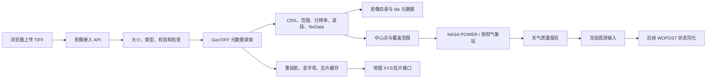

# M4 影像导入与地块地图方案

## 目标

左侧工作区负责导入和管理 TIFF 影像，右侧地图显示卫星底图、地块位置和影像覆盖范围。影像的坐标系、时间、波段和质量信息必须保留，天气获取和后续观测同化都引用同一份影像元数据。

截图只作为交互参考：左侧是数据和图层任务栏，右侧是地图工作区；不复制截图中的品牌、文字或服务配置。

## 先明确“未拼接完整”的两种情况

| 情况 | 处理方式 | 是否自动补值 |
|---|---|---|
| 一组合法的分幅 GeoTIFF 尚未拼成整幅影像 | 每个文件作为一个 tile 登记，按坐标在地图上叠加；有重叠时显示质量提示 | 否 |
| 单个 TIFF 内存在 NoData、缺块或边缘覆盖不足 | 保留 NoData 和实际 footprint，地图显示缺口 | 否 |
| 文件截断、目录损坏或无法读取 | 拒绝导入，返回可读错误和修复建议 | 否 |

系统不会把缺失区域涂成正常作物，也不会用卫星底图颜色替代影像值。

## 产品交互

### 左侧任务栏

1. 选择地块或新建影像任务。
2. 导入一个或多个 `.tif/.tiff` 文件，显示上传进度、文件名和校验和。
3. 查看影像状态：待检查、可显示、存在缺口、缺少坐标、检查失败。
4. 展开图层：真彩色、单波段、NDVI/其他已确认指数。没有明确波段含义时只显示原始波段，不自动命名指数。
5. 调整日期、图层透明度、数值范围和 NoData 显示。
6. 选择“获取天气”，查看影像中心点、地块中心点、最近站点和 NASA 网格源的距离与覆盖日期。

### 右侧地图

地图由三层组成：可配置的卫星底图、地块边界/中心点、影像瓦片。影像图层使用透明度和色带渲染；地图缩放、时间选择和图层切换不会修改原始影像。

卫星底图使用 provider adapter，开发环境可以使用公开测试底图，正式环境必须配置有授权的影像服务和来源标识。没有底图密钥时仍可查看影像范围和矢量边界，不能伪装成卫星图。

## 后端架构

### 第一阶段：影像检查和地图显示

- Python 使用 rasterio/GDAL 读取 GeoTIFF，不在 API 进程中执行不受限的命令行。
- 提取 CRS、仿射变换、边界、宽高、波段数、dtype、NoData、分辨率、时间标签和压缩方式。
- 输入保存到对象存储或本地受控目录，SQL 只保存文件哈希、来源、地块、范围和版本。
- 将可显示资料转换为带金字塔的 Cloud Optimized GeoTIFF，地图按 XYZ 请求小范围瓦片。
- 初版只支持合法 GeoTIFF 和已知坐标系；无 CRS 的影像进入“缺少坐标”状态，不允许直接叠加到地图。

建议的接口：

| 接口 | 用途 |
|---|---|
| `POST /api/v1/imagery/uploads` | 创建上传任务并返回大小限制和任务编号 |
| `POST /api/v1/imagery/uploads/{id}/files` | 上传一个 TIFF 分幅并进行检查 |
| `GET /api/v1/imagery/assets?plot_id=...` | 查询影像和分幅状态 |
| `GET /api/v1/imagery/assets/{id}/metadata` | 返回地理范围、波段和质量报告 |
| `GET /api/v1/imagery/assets/{id}/tiles/{z}/{x}/{y}` | 返回地图瓦片 |

### 第二阶段：气象关联

影像元数据解析完成后，以影像 footprint 的质心和地块质心分别计算天气位置。系统按以下顺序生成候选：

1. 有授权且日期覆盖完整的站点观测；
2. 距离和海拔差在阈值内的站点观测；
3. NASA POWER 网格历史资料。

每次请求保存来源、请求坐标、站点编号或网格坐标、日期范围、时区、缺测统计和原始响应哈希。站点目录候选不能直接当作站点观测使用。

### 第三阶段：遥感反演和同化

先做辐射定标、反射率质量检查和波段映射，再计算 NDVI、覆盖度和 LAI。没有标定板、波段定义或有效日期的文件只能作为可视化图层，不能进入模型同化。

同化以版本化观测为输入，使用有界更新和先验约束修改 WOFOST 状态，保留：原始预测、观测值、校准参数、误差、更新时间和重算任务。每次同化都建立新的输入快照，不覆盖原始模拟。

## 数据表和存储边界

第一阶段需要新增 `imagery_assets`、`imagery_tiles` 和 `imagery_observations` 的设计；大文件放对象存储或受控文件目录，SQL 保存元数据和哈希。Redis 暂不作为必选依赖，只有在瓦片缓存或上传协调成为瓶颈时再引入。

## 开发验收顺序

1. 用一份实际 GeoTIFF 验证 CRS、范围、波段和 NoData 解析。
2. 用两份有重叠或有间隔的分幅文件验证地图叠加和缺口提示。
3. 验证瓦片接口、权限、文件大小限制、路径穿越和跨组织隔离。
4. 用影像中心点查询天气，检查站点候选、NASA 回退和来源哈希。
5. 最后才接入指数、LAI 和 WOFOST 同化；未完成农艺验证前，页面显示为“观测校准候选”，不显示确定诊断。

## 需要的样例资料

开始编码前需要至少一份脱敏 TIFF，最好包含：文件大小、是否多波段、传感器和波段说明、坐标系、拍摄日期、NoData 定义，以及一组尚未拼接的分幅文件（如果实际业务就是分幅上传）。如果暂时不能提供原始影像，可以提供 `gdalinfo` 或 rasterio 的元数据输出和一小块测试影像。
