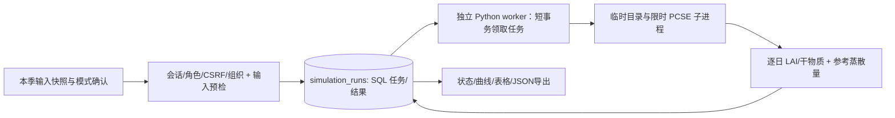

# M3.2 潜在生长计算

本轮交付封存输入 → SQL 计算任务 → 隔离 PCSE6.0.13 子进程 → 逐日结果/曲线/导出的实际链路。模型为 Wofost72_PP，水肥充足、无病虫害胁迫的潜在生产模式；并非水田灌排或肥料响应模型。仅直播、明确出苗、已发生的连续北京时间天气和完整自有参数可运行，不预置未经许可的真实品种。

## 数据流和组件

API 仅创建和读取任务，不执行重计算。单进程 worker 轮询 SQL，无 Redis/通用队列框架。SQLite 写事务和 PostgreSQL SKIP LOCKED 领取；120秒租约、60秒计算超时、最多3次领取。过期任务可恢复，租约令牌防止旧进程覆盖新结果。结果完成与审计同事务；成功输出及原输入哈希永久保留。生产多进程容量与备份恢复留待 M7。

input_assets / simulation_inputs 保持只追加，simulation_runs 是任务状态机，允许 queued→running→succeeded/failed；过期 running 可重领。用户重新计算创建新任务，原结果不覆盖。请求 UUID 用于重复提交去重。当前输入检查的 simulation_available 仅表示输入满足潜在模式条件；用户还需确认适用条件和启动 worker。旧快照报告保持原值。

## API 和数据

全部业务需 Cookie；POST 需 JSON、Origin、X-CSRF-Token 和写角色。本地 HTTP，HTTPS/发布待 M7。

| 方法/路径 | 请求 | 响应 |
|---|---|---|
| POST /api/v1/simulation-runs | input_id、request_key UUID、acknowledge_potential_only=true | 202 任务摘要，重复 key 返回同任务；key/输入冲突409 |
| GET /api/v1/simulation-runs | season_id、limit/offset | 本组织季节的任务摘要 |
| GET /api/v1/simulation-runs/{run_id} | UUID | 状态、失败安全提示或完整结果与哈希 |

缺输入/不支持模式400，结构422，会话401，权限/CSRF403，跨组织404，冲突409，存储503。列表不复制逐日结果；无 worker 时保持排队，页面提供检查运行进程的指引。

simulation_runs：UUID id、organization_id、season_id、input_id、actor_user_id、request_key；model_code/engine_version、input_hash、status、attempts、created_at/started_at/finished_at/lease_expires_at、lease_token、error_code、result JSON/nullable、result_hash/nullable。逻辑外键，组织/request_key唯一，组织/季节/创建时间及状态/租约索引，DDL 0004 冻结。私有租约字段不出 API。

## 科学与安全边界

天气新增可选 angstrom_a/b（同时提供），范围 A=0.1–0.4、B=0.3–0.7、A+B=0.6–0.9，用于 PCSE reference_ET；不猜测当地系数。原有天气资料仍可保存，缺系数不能运行。reference_ET 输出 mm/day，除10后传给 WeatherDataContainer 的 E0/ES0/ET0 cm/day。所有规范化天气留在结果，原 CSV 留在输入。

从实际出苗开始，运行至已发生天气截止日，成熟可提前终止作物输出，last_crop_date 单独记录；不补造未来曲线，不通过截止日触发虚构收获。输出 LAI、DVS、地上部和贮藏器官干物质，后者不标为实收产量。参数未独立验证；农事封存但不产生管理效应，需修改管理/资料后保存新快照再计算。

PCSE 仅在子进程导入。白名单环境不携带应用数据库/账号秘密；临时用户配置和空演示库标记阻止默认用户目录/演示库副作用，不查询 PCSE 数据库、不访问外部参数/天气服务。官方算法依赖有 EUPL 许可，见第三方清单。真实官方内核运行测试与合成参数仅证明接口可执行，不证明华南水稻精度。

自动站点搜索/联网天气、水田管理和移栽、校准、地图仍在后续实施；M3 整体保持进行中。
