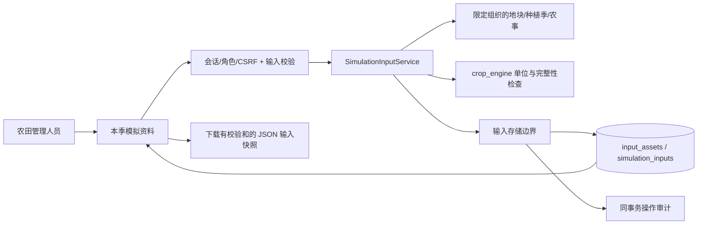

# M3.1 模拟输入资料与快照

本模块处理土壤、品种参数、天气资料和输入快照。生长计算见 [M3.2](potential-simulation.md)，历史天气及站点目录见 [M3.3](weather-sources.md)。具体县市和品种资料尚待确定，系统不预置演示参数作为默认值；当地验证完成后再评估产量预测用途。

## 用户流程和数据流

管理员或农田管理成员录入本地土壤，导入农艺人员准备的品种参数 JSON 和天气 CSV；只读成员可查看与导出本组织资料。按本季选择三份资料、明确出苗日期和资料截止日，检查缺测/参数后保存快照。新资料和新快照只追加，原版本不覆盖。管理记录修订后新建快照保留最新版本，旧快照保持原内容。

## 数据设计

三类资料共用 input_assets 表，simulation_inputs 保存种植季输入版本，迁移版本为 0003。

| 表 | 内容 |
|---|---|
| input_assets | 资料类型、名称、来源、许可、内容及哈希 |
| simulation_inputs | 种植季、递增版本、快照及哈希 |

input_assets 还记录 id、organization_id、plot_id、created_at 和 actor_user_id。kind 为 soil/crop/weather，品种的 plot_id 为 null，其余必填。JSON 按资料类型校验，仅作为数据保存。simulation_inputs 记录组织及创建人和时间。关系在同一事务检查，采用逻辑外键。

每份资料均有来源和使用许可说明，内容哈希采用排序键、UTF-8、禁止NaN的规范JSON，整数值浮点数统一为整数，负零归一为零，确保浏览器导出后核验一致。SHA-256覆盖payload，不是来源认证或数字签名。来源 URL 用于记录，服务器不自动访问。

天气用 station 标记站点观测，用 gridded 标记网格数据，并记录来源位置和海拔。M3.3 增加固定源获取及可选 provider 字段，保存原始 JSON、请求和哈希；保存时重新计算并检查一致性。授权站点观测接口仍待接入。

## 接口（仅 GET/POST）

全部需要 crop_twin_session Cookie，POST 还需 JSON、X-CSRF-Token 与写角色；本地 HTTP，生产 HTTPS 待 M7。

| 方法 | 路径 | 内容 |
|---|---|---|
| GET | /api/v1/input-assets | kind、plot_id、limit/offset 查询本组织资料摘要 |
| POST | /api/v1/input-assets | kind 判别的土壤/品种/天气请求；返回 201 |
| GET | /api/v1/input-assets/{asset_id} | 资料详情，跨组织返回 404 |
| POST | /api/v1/simulation-inputs/check | 选择三份资料、种植季、出苗日期和截止日；返回输入完整性报告，不写数据 |
| GET/POST | /api/v1/simulation-inputs | 季节快照分页 / 保存不可变输入快照 |
| GET | /api/v1/simulation-inputs/{input_id} | 完整 JSON 和校验和，用于导出 |

资料结构和请求/响应字段由 OpenAPI 输出。非法单位/日期/数值为 400/422，无会话 401、无角色/CSRF 403、跨组织/不存在 404，存储冲突 409/故障 503。持久化及审计失败一起回滚。

## 资料校验

土壤体积含水率满足 0 <= 萎蔫点 < 田间持水量 < 饱和含水量 <= 1，深度以 cm 记录。天气列为 date,tmin_c,tmax_c,rain_mm,radiation_mj_m2,wind_m_s,vapor_kpa；风速为 2m 高度，温度上下限正确，日期不重复，数值有限。最多 366 天、CSV 256 KiB；缺测不补零，逐日检查截止期。辐射转换为 J/m²、雨为 cm、蒸汽压为 hPa，保留原始数据/单位。PCSE 蒸汽压范围 0.06–199.3 hPa、天气源海拔 -300–6000m；超范围原值保留但预检阻塞。输入转换不计算 E0/ES0/ET0；这些值由 M3.2 天气提供器按来源 Angstrom 系数计算，原 CSV 保留。

品种参数只接受有限数值或有限数值数组，表格横轴递增；完整性清单针对 WOFOST72 的标准参数边界，属于静态预检，并非实际引擎或农艺验证。不接收 Python/CABO 可执行代码或不安全 YAML。品种与种植季名称不一致时提示核对。出苗日独立录入，不把播种/移栽日直接当出苗；移栽适配未完成时报告阻塞。

快照保存地块、种植季、最新农事版本、三份资料、来源与许可、规范天气、校验报告及软件和契约版本。

| 标记 | 含义 |
|---|---|
| input_ready | 静态输入检查通过 |
| simulation_available | 0.5 起表示满足潜在计算输入条件；0.4 旧报告保持 false |
| simulation_executed | 输入快照始终为 false，执行状态由任务结果记录 |

农事目前用于记录和追踪，尚未转换为模型管理信号。灌溉量记录施用水量，肥料质量记录产品质量，有效入渗水和纯氮量需要额外资料。

快照最多 1 MiB、资料最多 512 KiB、单季最多 5000 条有效农事，超限明确拒绝，不静默截断。payload 的 schema_version=1.0.0。下载后可执行 uv run --locked python scripts/verify_input.py <文件> 核验。

参考：[PCSE 输入与天气](https://pcse.readthedocs.io/en/stable/quickstart.html)、[WOFOST 参数结构](https://github.com/ajwdewit/WOFOST_crop_parameters)。检查结果见开发日志。

0.5 起天气可填写 angstrom_a/b，要求成对提供并符合 PCSE 范围。缺系数时可保存资料和快照，补齐后另存版本再计算，旧输入和报告保留。
