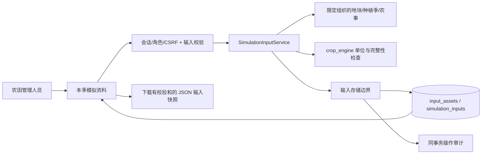

# M3.1 模拟输入资料与快照

本输入子模块交付土壤、品种参数、天气导入与输入快照，独立计算见[M3.2](potential-simulation.md)，历史网格获取/站点目录见[M3.3](weather-sources.md)。M3保持进行中，授权站点观测、长季合并和水田验证仍待实施；未经当地验证的参数不用于产量预测。试点县市/品种未指定时不填入演示默认值。

## 用户流程和数据流

管理员或农田管理成员录入本地土壤，导入农艺人员准备的品种参数 JSON 和天气 CSV；只读成员可查看与导出本组织资料。按本季选择三份资料、明确出苗日期和资料截止日，检查缺测/参数后保存快照。新资料和新快照只追加，原版本不覆盖。管理记录修订后新建快照保留最新版本，旧快照保持原内容。

## 数据设计

同一输入模块中的三类资料共用 input_assets 表：id、organization_id、plot_id（品种为 null，其余必填）、kind（soil/crop/weather）、name、source、source_license、payload JSON、content_hash、created_at、actor_user_id。JSON 内容按三个确定的类型校验，不能作为任意文件/脚本执行。simulation_inputs 保存组织、种植季、递增版本、payload、SHA-256 和创建人/时间。逻辑关系在同一事务校验，无物理外键。索引与迁移 0003 同步。

每份资料均有来源和使用许可说明，内容哈希采用排序键、UTF-8、禁止NaN的规范JSON，整数值浮点数统一为整数，负零归一为零，确保浏览器导出后核验一致。SHA-256覆盖payload，不是来源认证或数字签名。源引用只是记录，不由服务器自动访问任意URL。天气区分station（站点观测）与gridded（网格数据），附来源位置/海拔；网格不标成最近气象站。M3.3增加固定源明确点击获取、可选provider原始JSON/请求/hash；保存重算一致性并沿用输入体积/审计。授权站点观测尚待接入。

## 接口（仅 GET/POST）

全部需要 crop_twin_session Cookie，POST 还需 JSON、X-CSRF-Token 与写角色；本地 HTTP，生产 HTTPS 待 M7。

| 方法 | 路径 | 内容 |
|---|---|---|
| GET | /api/v1/input-assets | kind、plot_id、limit/offset 查询本组织资料摘要 |
| POST | /api/v1/input-assets | kind 判别的土壤/品种/天气请求；返回 201 |
| GET | /api/v1/input-assets/{asset_id} | 资料详情，跨组织返回 404 |
| POST | /api/v1/simulation-inputs/check | 选择三份资料、种植季、出苗日期和截止日；返回输入完整性报告，不写数据 |
| GET/POST | /api/v1/simulation-inputs | 季节快照分页 / 保存不可变输入快照 |
| GET | /api/v1/simulation-inputs/{input_id} | 完整 JSON 和校验和，用于导出 |

资料结构和请求/响应字段由 OpenAPI 输出。非法单位/日期/数值为 400/422，无会话 401、无角色/CSRF 403、跨组织/不存在 404，存储冲突 409/故障 503。持久化及审计失败一起回滚。

## 校验与科学边界

土壤体积含水率满足 0 <= 萎蔫点 < 田间持水量 < 饱和含水量 <= 1，深度以 cm 记录。天气列为 date,tmin_c,tmax_c,rain_mm,radiation_mj_m2,wind_m_s,vapor_kpa；风速为 2m 高度，温度上下限正确，日期不重复，数值有限。最多 366 天、CSV 256 KiB；缺测不补零，逐日检查截止期。辐射转换为 J/m²、雨为 cm、蒸汽压为 hPa，保留原始数据/单位。PCSE 蒸汽压范围 0.06–199.3 hPa、天气源海拔 -300–6000m；超范围原值保留但预检阻塞。纯输入转换尚不包含E0/ES0/ET0；M3.2实际天气提供器按来源Angstrom系数计算蒸散量，不改原CSV。

品种参数只接受有限数值或有限数值数组，表格横轴递增；完整性清单针对 WOFOST72 的标准参数边界，属于静态预检，并非实际引擎或农艺验证。不接收 Python/CABO 可执行代码或不安全 YAML。品种与种植季名称不一致时提示核对。出苗日独立录入，不把播种/移栽日直接当出苗；移栽适配未完成时报告阻塞。

快照同时封存地块、季节、最新农事版本、三份资料、来源/许可、规范化天气、校验报告和软件/契约版本。报告的 input_ready 只表示本阶段输入检查通过，0.5新增simulation_available表示满足潜在模式输入，禁止表示已运行、worker在线或预测可靠；0.4旧报告保持false。灌溉量不是有效入渗量，肥料质量不是纯氮量，农事在本阶段只保存，尚未转换为模型信号。

快照最多 1 MiB、资料最多 512 KiB、单季最多 5000 条有效农事，超限明确拒绝，不静默截断。payload 的 schema_version=1.0.0。下载后可执行 uv run --locked python scripts/verify_input.py <文件> 核验。

依据：[PCSE 输入与天气](https://pcse.readthedocs.io/en/stable/quickstart.html)、[WOFOST 参数结构](https://github.com/ajwdewit/WOFOST_crop_parameters)。实际验证与限制见开发日志。

0.5天气资料可带angstrom_a/b，成对提供并校验PCSE范围；缺系数仍可存资料/快照，但不能潜在计算。输入快照simulation_executed始终false，实际任务结果单独标记，旧输入/报告不回写。
