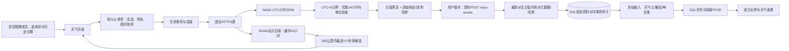
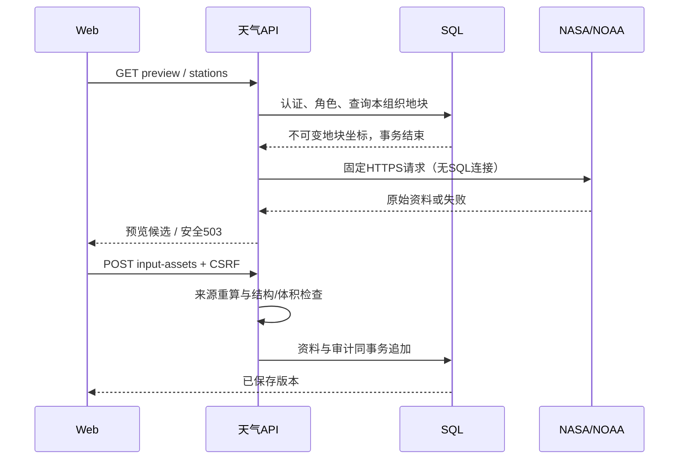

# M3.3 天气源与站点目录

软件/API/Web0.6.0、算法包0.3.1，NASA小时转换适配1.0.0；PCSE仍为6.0.13，潜在计算适配1.0.1仅增加来源元数据。输入/结果schema_version仍为1.0.0，本轮为可选字段扩展，不修改旧资料/快照。

## 功能概述与运行环境

管理员或农田管理成员在“模拟资料”选择“按农田位置获取天气”，填写历史起止日，预览后下载CSV或保存天气版本，再选择土壤/品种并封存计算输入。资料来自NASA POWER网格，不是站点实测。附近NOAA站点目录提供位置、距离、历史覆盖候选；没有拉取站点观测。只读成员可读取已保存资料。

继续使用Python3.12/FastAPI、Vue/TypeScript/CSS、SQLite或PostgreSQL和已有独立worker。API所在机器需要访问固定HTTPS数据源，使用系统信任证书；没有新依赖、数据库表、迁移、Redis或密钥配置。CSV离线导入仍可用，启动API不联网。

## 产品架构与模块职责

| 模块 | 文件/目录 | 语言 | 职责 |
|---|---|---|---|
| 天气页面/API客户端 | frontend/src/features/simulation/WeatherSourcePanel.vue、weatherApi.ts | Vue SFC、TypeScript | 日期、预览、重试、CSV下载、保存、站点列表 |
| HTTP入口/输入schema | backend/src/crop_twin/api/v1/weather.py、input_schemas.py | Python | 会话/组织/角色、查询参数、来源一致性与响应 |
| 固定源协调/缓存 | infrastructure/weather/sources.py | Python | 获取候选、来源封存、24小时目录缓存 |
| 传输 | infrastructure/weather/http.py | Python标准库 | 固定HTTPS白名单、禁止重定向、并发/体积/超时限制 |
| 数据转换/站点筛选 | infrastructure/weather/power.py、stations.py | Python | 日界、单位、24小时完整性、哈希核对、球面距离 |
| 错误对象 | domain/simulation/weather.py | Python | 稳定业务错误，不依赖HTTP/SQL |
| 持久化与计算 | 现有input_service、SQL、crop_engine | Python | 追加资料/审计/冻结输入，隔离PCSE计算 |
| 契约/文档/测试 | contracts、docs、backend/tests、frontend/tests | JSON/YAML、Markdown/Mermaid、Python/TypeScript | 接口、设计、日志与验收 |

天气模块自身内聚于infrastructure/weather；复用真实输入存储边界。应用/领域和算法不依赖NASA客户端，不引入通用下载平台。API通过create_app(weather_sources=...)支持隔离验收；生产入口不使用测试客户端。

## 数据流





## 日值转换与边界

NASA固定Hourly/Point、community=AG、time-standard=UTC，取起始日前一日到截止日。北京时间某日00–23时对应UTC前日16时至当日15时，不能直接使用UTC日值并只改日期标签。

| NASA变量/声明单位 | 输出列/单位 | 方法 |
|---|---|---|
| T2M / C | tmin_c、tmax_c / ℃ | 24个小时值最小/最大；不是站点日极值 |
| WS2M / m/s | wind_m_s / m/s | 2米风速24小时平均 |
| PRECTOTCORR / mm/hour | rain_mm / mm | 24小时累加 |
| ALLSKY_SFC_SW_DWN / MJ/hr | radiation_mj_m2 / MJ/m² | 固定AG小时辐射单位，24小时累加；不猜测其他单位 |
| T2MDEW / C | vapor_kpa / kPa | 每小时按0.6108×exp(17.27×Tdew/(Tdew+237.3))计算，再平均 |

每一天五个变量必须有24个有限数值，拒绝填充值、布尔/空值、负降水、异常范围和单位/日界变化；露点超过气温0.2℃拒绝。日值保留6位小数并复用标准CSV检查。网格返回坐标须与请求相符（差值≤0.001°），网格海拔不是农田实测海拔。

最早北京时间2001-01-02，每次1–120个已结束的日历日，不能取当天或未来；POWER近期资料通常有数日延迟，完全结束日期不保证源已有完整资料。NASA响应上限384KiB，站点目录8MiB，单进程最多两个并发上游请求，socket超时15秒，无自动重试；socket超时不是整个接口的硬总时限。资料512KiB/快照1MiB上限不变，超限拒绝，未实现长季分段合并。

Angstrom A/B默认空，不从气象资料猜测。可先保存不完整天气；实际计算仍需资料提供者同时声明A/B，补齐时新增资料版本和输入快照。当前潜在模式使用网格天气会增加适用条件说明，不能据此宣称当地预测精度。

## 接口与完整请求

1. **GET /api/v1/weather/preview?plot_id=UUID&start_date=2024-03-02&end_date=2024-03-03**：按本组织地块坐标获取未保存候选；没有请求体。
2. **GET /api/v1/weather/stations?plot_id=UUID**：获取附近目录候选；没有请求体。
3. 保存复用 **POST /api/v1/input-assets**，JSON体为预览的完整asset，可补A/B；详见现有输入模块和OpenAPI。

请求头：Cookie: crop_twin_session=<会话>、Accept: application/json。GET不需要CSRF；保存POST还需要Content-Type: application/json、合法Origin、X-CSRF-Token。当前回环HTTP开发服务没有传输加密，外部数据源使用验证证书的HTTPS；公开HTTPS部署保留到M7。所有响应Cache-Control: no-store。

```http
GET /api/v1/weather/preview?plot_id=550e8400-e29b-41d4-a716-446655440000&start_date=2024-03-02&end_date=2024-03-03 HTTP/1.1
Host: 127.0.0.1:8000
Accept: application/json
Cookie: crop_twin_session=<已登录会话>
```

200结构为asset（kind、plot_id、name、source、source_license、data）、day_count、sample_days（最多5日）、warnings。data为标准天气结构与provider。响应包含整个原始小时JSON，完整字段与类型以[导出契约](../../contracts/openapi.json)为准；它是随后保存请求的完整候选，页面不另行重新拼装来源。

站点成功响应示例（空候选也为成功，以下校验和仅为格式示例）：

```json
{"source":"NOAA NCEI ISD station history","source_url":"https://www.ncei.noaa.gov/pub/data/noaa/isd-history.csv","catalog_hash":"0000000000000000000000000000000000000000000000000000000000000000","retrieved_at":"2026-10-09T00:00:00+00:00","radius_km":200,"stations":[],"notice":"仅为公开目录位置候选；覆盖日期不证明当前活跃或资料完整，尚未接入站点观测。"}
```

失败示例：503 `{"detail":{"code":"WEATHER_NETWORK_FAILED","message":"天气数据源暂时无法访问，请稍后重试或导入CSV"}}`。400 WEATHER_PERIOD_INVALID为日期业务错误；401会话失效、403只读、404不存在/跨组织、422结构/来源不一致。503还包括WEATHER_BUSY、WEATHER_TOO_LARGE、WEATHER_DATA_INVALID、STATION_DATA_INVALID。错误不包含远程响应正文、SQL或认证秘密，失败不保存部分天气，不回退到虚构值。

## 数据管理与验证

weather.payload新增可空provider：code=nasa_power_hourly、adapter_version=1.0.0、start_date/end_date、requested_latitude/longitude、retrieved_at、raw_response、raw_hash。原始响应为解析JSON，保留全部字段；不保留HTTP字节的空白/键顺序。raw_hash是规范JSON SHA-256；保存时重新生成CSV并核对来源位置、海拔、日界、哈希，保护内容一致性。用户可提交自有内容，哈希不是NASA签名或真实性认证。

原始小时响应和派生日值随input_assets、simulation_inputs封存，沿用同事务审计，无额外表。PCSE成功结果weather_method增加source_kind和raw_hash，参考输入中的原始来源，重算不再联网。旧输入/结果不改写。目录缓存仅用于候选检索，进程重启可重新获取，不作为业务唯一存储。

软件验收覆盖UTC+8前日边界、24小时缺测拒绝、单位/填充值、来源篡改、角色/组织、SQL在HTTP前释放、失败无部分保存、缓存过期、传输限制及真实worker/PCSE跨层链路。自动测试的小时响应和站点为自行构造合成资料，浏览器源明确标记软件测试；只在test临时库注入。真实公网烟雾验证与自动测试分别记录，测试数量/覆盖率和失败经过见[开发日志](../dev-log/2026-10-09-weather-sources.md)。

依据：[NASA小时API](https://power.larc.nasa.gov/docs/services/api/temporal/hourly/)、[数据/单位/延迟](https://power.larc.nasa.gov/docs/faqs/data/)、[NOAA ISD](https://www.ncei.noaa.gov/products/land-based-station/integrated-surface-database)、[FAO露点公式](https://www.fao.org/4/x0490e/x0490e07.htm)。许可与数据使用记录见[第三方清单](../../THIRD_PARTY.md)，设计取舍见[ADR0006](../adr/0006-weather-sources.md)。授权站点观测、当日自动更新、预测、移栽/水田适配和当地实测验证待后续模块。
